# Playwrite

*Playwrite* is a typeface engine that allows the creation of primary school cursive fonts. These school fonts are the practical result of the Primarium research project [www.primarium.info] a groundbreaking educational effort that documents the history and current practice of instruction methodologies and models taught to primary school students worldwide. Its findings with regards to the calligraphic models currently in use, their development and rationale, informed the design of the *Playwrite* glyphs.

The shape of the handwritten Latin alphabethas developed following different currents, trends and colonial influences around the world. As a result, the very notion of what constitutes primary school cursive writing varies dramatically. It could be vertical or slanted, fully joined or semi-joined, uppercase letters can be ornate and decorative or simply borrowed from print styles, lowercase letters can be based on round or oval foundational shapes, and the proportion of the x-height vis-a-vis the ascenders and descenders can differ.

 

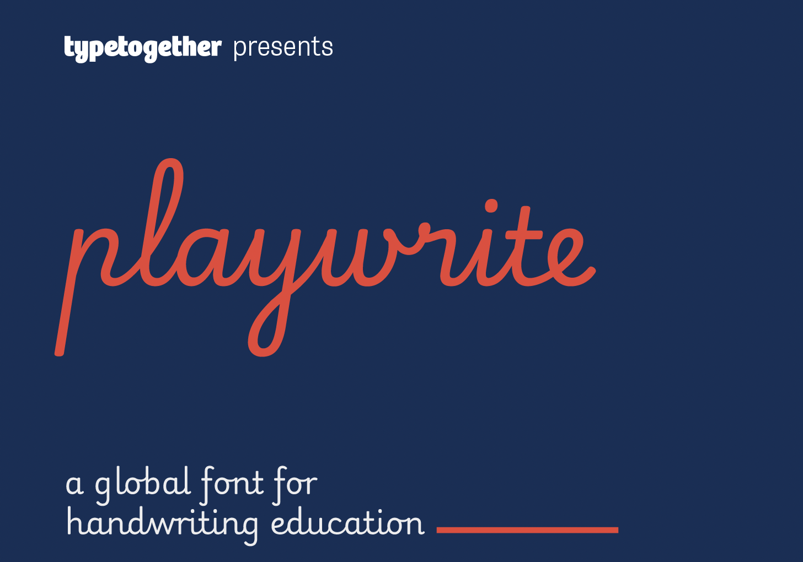

## Build instructions

The definitive, stable, fonts are built by the Continuous Integration engine, which runs every time the source files are updated in the repository. It produces a .zip file with all the built fonts that which is included on each `Action` run as well as pushes the produced fonts into the `fonts` directory.

If you want to build fonts manually on your own computer as part of the development or testing process:

* `make build` will produce font files. But they should not be pushed manually to the repository. Once you are happy with the changes in the source files, please only push the sources and the CI run will produce the definitive fonts.

## Letter variations

Based on the Primarium study the TypeTogether team isolated a limited number of structural variations for the Latin letter shapes: 8 variation styles for lower cases and three for uppercases. With the help of a sturdy contextual alternate (`CALT`) opentype code these different variation groups can be seamlessly combined.

### Precursive

Default set of lower case letters. These are completely unjoined.  

 

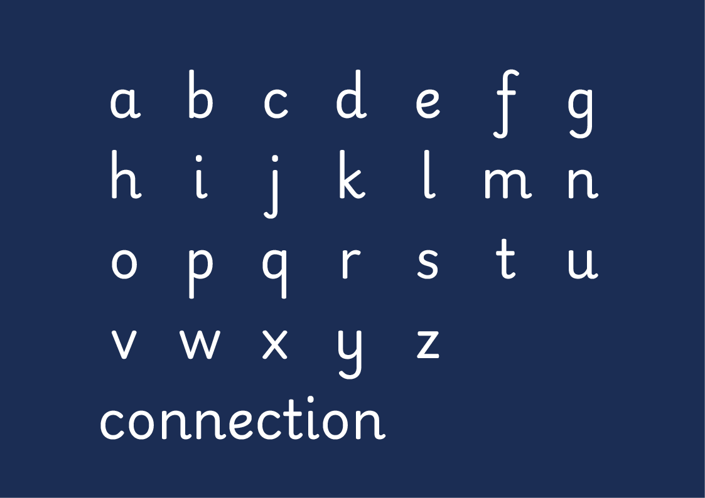

### Modern cursive

Same design as precursive in isolated shape but it triggers a semi-connected typesetting.
Uses .mod suffix (e.g. n.mod).

 

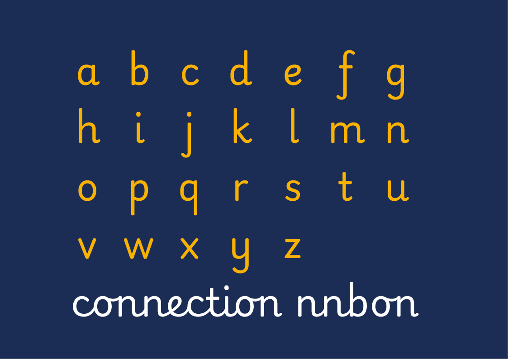

### Fully joined modern cursive

Adds loops to descenders and connecting strokes to letters that do not connect in .mod.
Uses .jmc suffix (e.g. g.jmc).

 

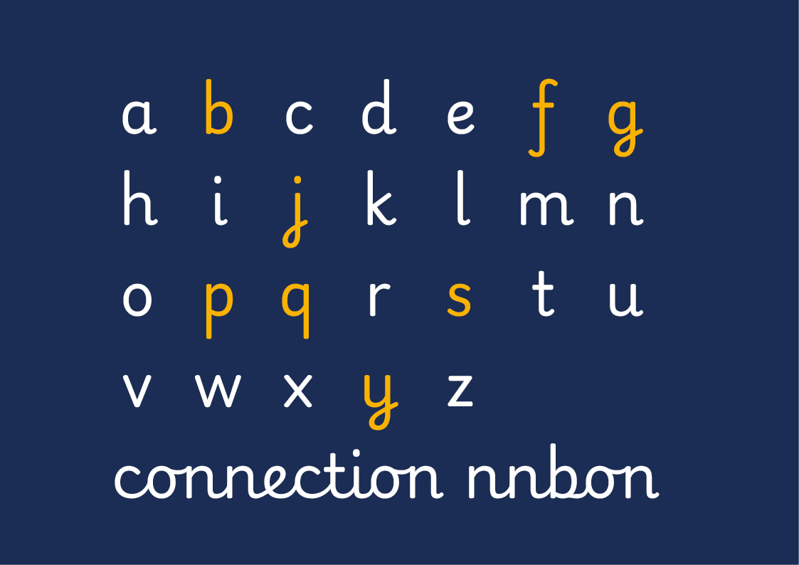

### Full Cursive

Construction of several glyphs change to match a continuous cursive style.
Uses .ful suffix (e.g. s.ful).

 

### Speed loops

Adds speed loops to most letters with ascender strokes.
Uses .lop suffix (e.g. h.lop).

 

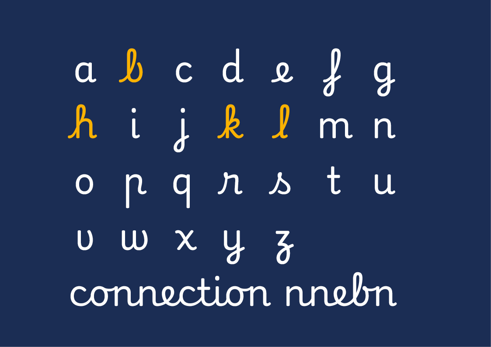

### Curved entry stroke

Changes the lead-in connection at x-heigh level for several letters.
Uses .cnt suffix (e.g. n.cnt).

 

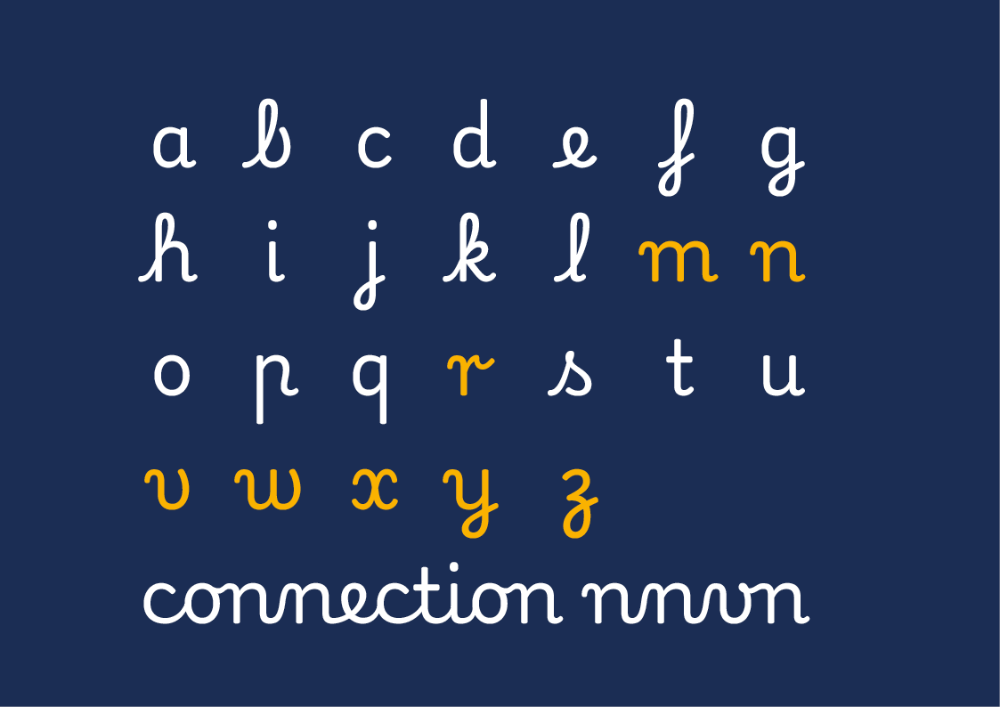

### Mirrored loops

Adds loops in to two letters and switches loop direction in “f”.
Uses .mrr suffix (e.g. f.mrr).

 

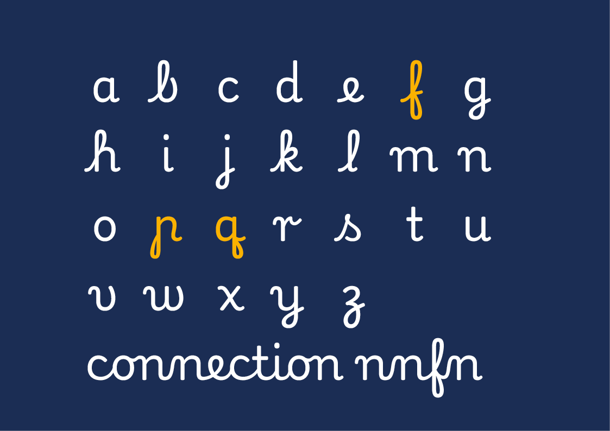

### Microloops

Adds knots or small loops to mark stroke direction change in some letters.
Uses .mlp suffix (e.g. o.mlp).

 

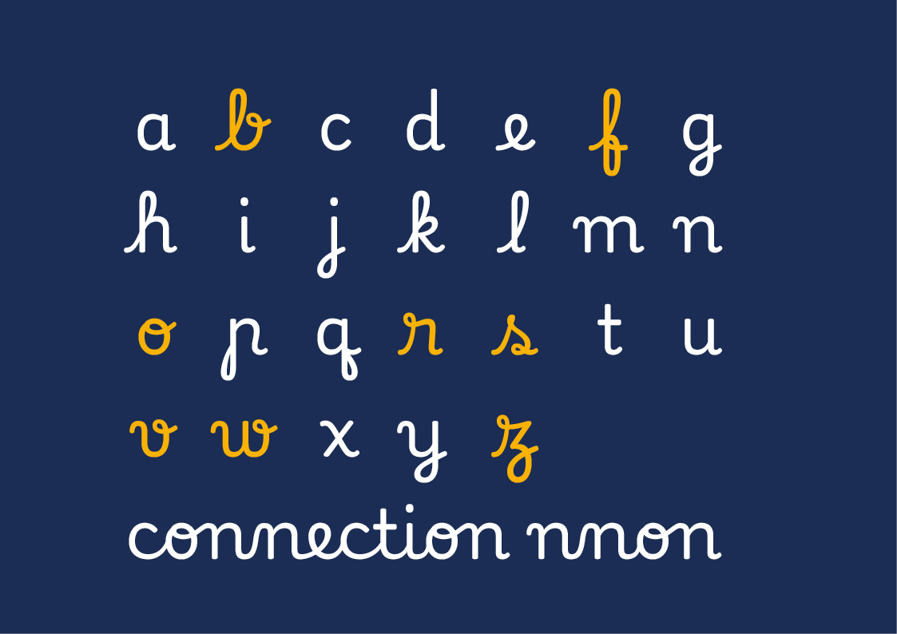

### Print

Default set of upper case letters. These are completely unjoined.  

 

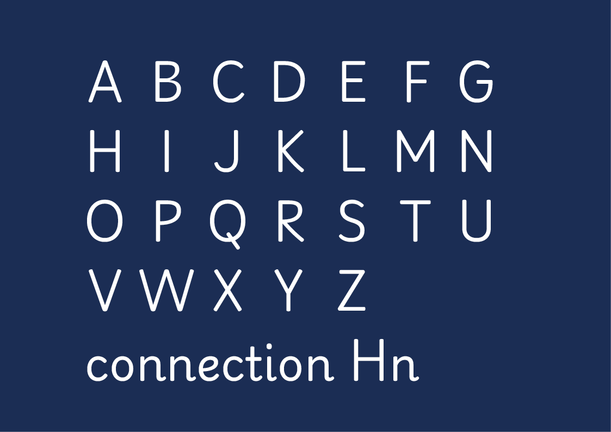

### Cursive upper cases

Cursive capitals. Also enable connection with a number of lowercase letters
Uses .cur suffix (e.g. A.cur).

 

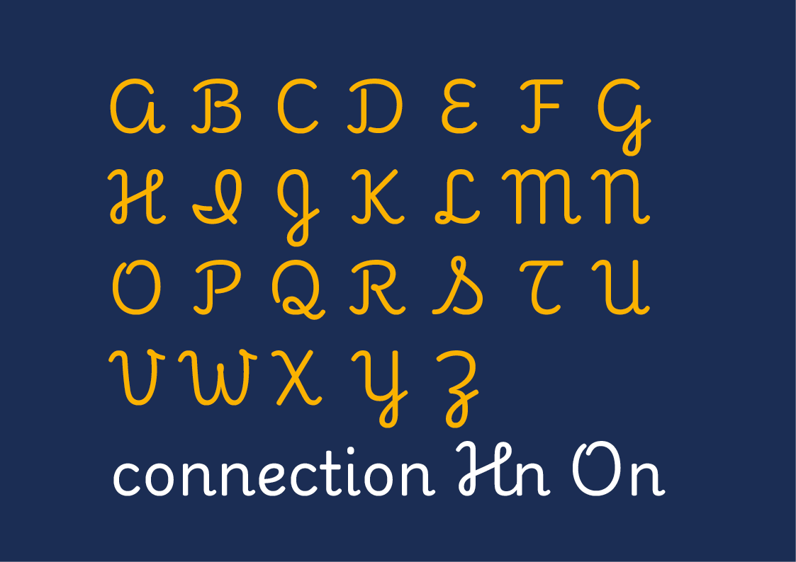

### Decorative upper cases

Secondary set of decorative capitals to match certain handwriting models. These are semi-connected.
Uses .dec suffix (e.g. G.dec).

 

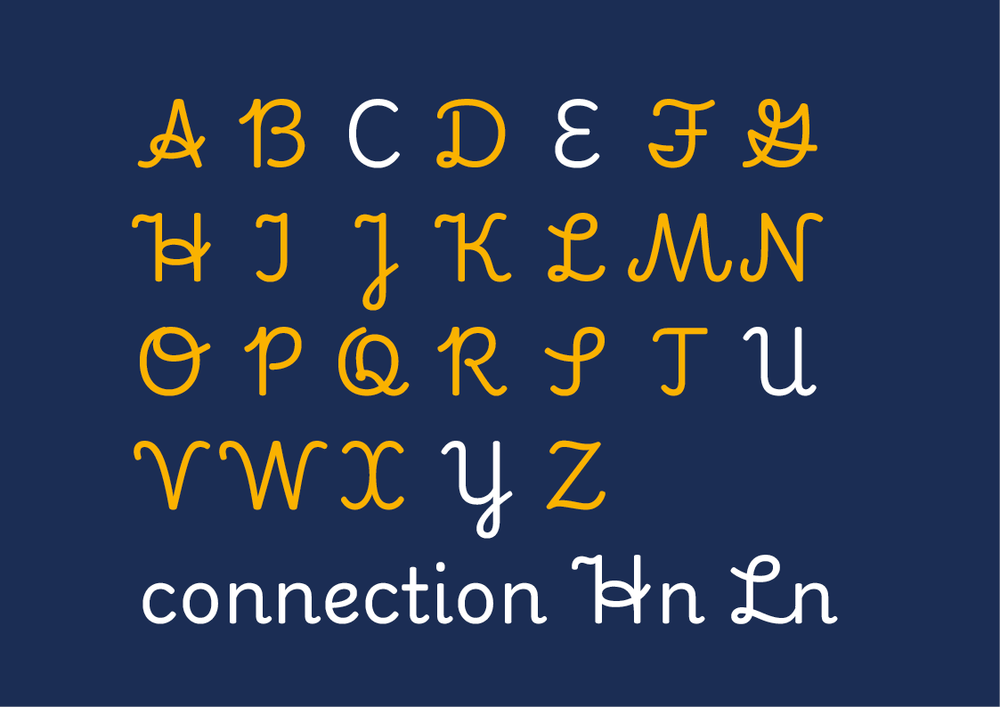

### Regional variants lower cases

Alternative designs necessary for one or more specific regions. These use suffix locl when used in several fonts or locl_XX where XX is a two letter country code. (e.g. Q.dec_pt).

 

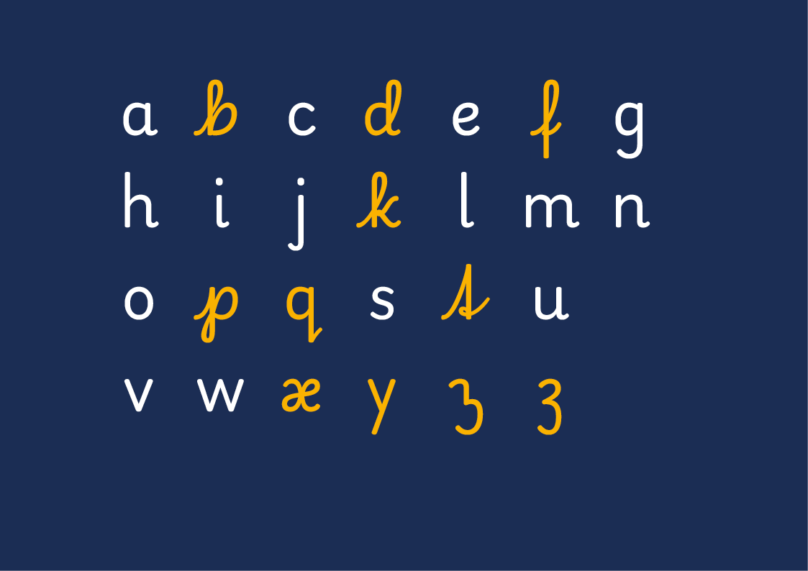

## Regional variants upper cases

 

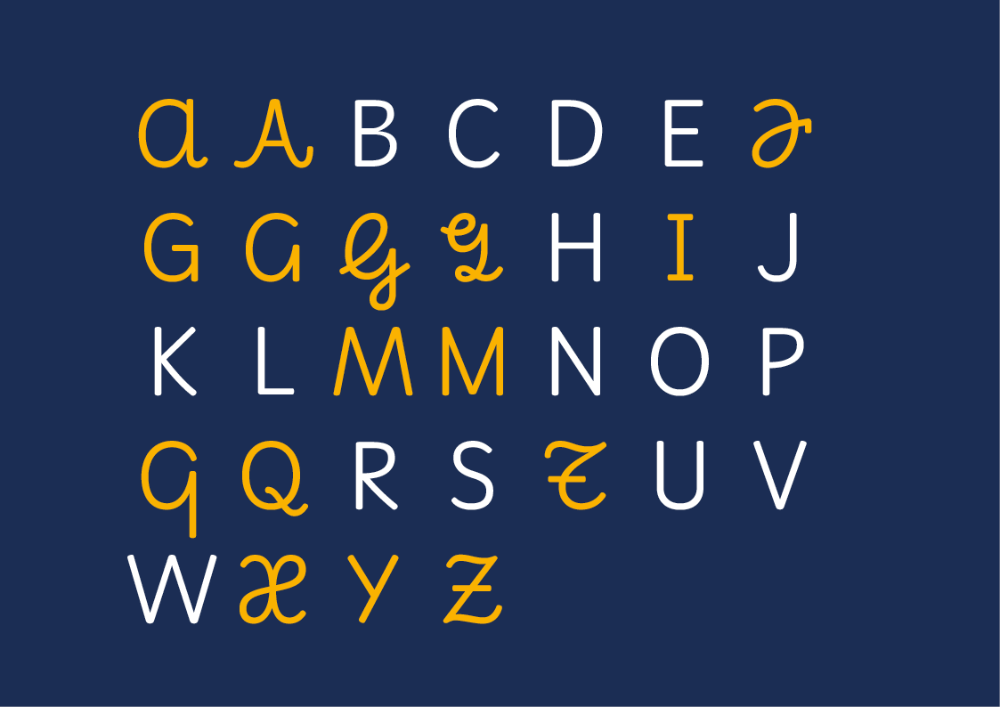

## Design variation axes

Playwrite's design space spans over four variation axes: the slant of the letters, ascender and descender length, typographic color, and a stroke speed axes that controls the tension of the curves and the direction and connection of the strokes.

- **Weight - `wght`** `Min: 100 Max: 400`

- **Slant - `slnt`** `Min: 0 Max: -18`

- **Speed - `SPED`** `Min: 0 Max: 100`

- **Vertical Extension - `YEXT`** `Min: 0 Max: 100`

 

## Country recipes

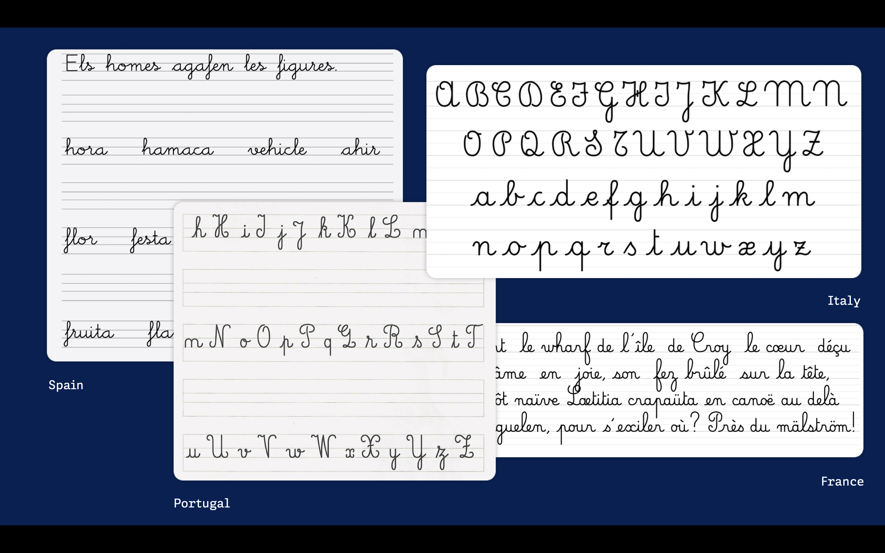

Recipes for regional models of the Playwrite font arecreated by recipes that reside on a CSV file `Playwrite/sources/data/models-all.csv`. Each row of the file contains the data that names the font model, specifies a location in three of the founr axes (the weight axis always remains variable), and contains a selection of the of the letter variants that are preferred in that region.

Structure of each row is as follows:  
`Country;lang_tag;slnt;EXTD;SPED;UC;lc`

The classes UC and lc must contain the exact number of glyphs that is expected in the substitution classes, and in the correct order:  
`@UC = [A B C D E F G H I J K L M N O P Q R S T U V W X Y Z AE Eth IJ Eng OE Thorn Germandbls];  `

`@lc = [a b c d e f g h i j k l m n o p q r s t u v w x y z ae eth ij eng oe thorn germandbls idotless jdotless];`

Here is an example of the recipe used for the Canada Playwrite Font:  
`Canada;CAN;18;496;100;A.cur_locl B.dec C.cur D.dec E.cur F.dec G.dec H.dec I.cur J.cur K.dec L.dec M.cur N.cur O.dec P.dec Q.cur R.dec S.cur T.dec U.cur V.cur W.cur X.cur Y.cur Z.cur AE.cur Eth IJ.cur Eng OE.cur Thorn Germandbls;a.mod b.lop c.mod d.mod e.ful f.mrr g.jmc h.lop i.mod j.jmc k.lop l.lop m.cnt n.cnt o.mod p.mrr_ca q.mrr r.ful s.ful t.mod u.mod v.cnt w.cnt x.ful y.cnt z.cnt ae.ful eth.mod ij.jmc eng oe.ful thorn.jmc germandbls.jmc idotless.mod jdotless.jmc `

## List of fonts by region

Each font model uses the following naming conventions:

- The country name is represented with a two-letter code abbreviation that follows the `Alpha-2 code` of the [ISO 3166](www.iso.org/glossary-for-iso-3166.html).
- Models with different variants are named using common abbreviations in each country (e.g., VIC for Victoria in Australia) or a designated variant name that is, in turn, localized using the country language (e.g. Traditionnelle in France).
- The `font family name` and `file name` use the two-letter code and variant abbreviations.
- The `display name` is the fully unabbreviated and localized name of a model. It is used on specimen pages and includes the country name translated into each country's language.

| Country        | Alpha-2 code | Variant        | Family name           | Display name                       |
| -------------- | ------------ | -------------- | --------------------- | ---------------------------------- |
| Argentina      | AR           |                | Playwrite AR          | Playwrite Argentina                |
| Australia      | AU           | NSW            | Playwrite AU NSW      | Playwrite Australia NSW             |
| Australia      | AU           | QLD            | Playwrite AU QLD      | Playwrite Australia QLD            |
| Australia      | AU           | SA             | Playwrite AU SA       | Playwrite Australia NSW            |
| Australia      | AU           | TAS            | Playwrite AU TAS      | Playwrite Australia TAS            |
| Australia      | AU           | VIC            | Playwrite AU VIC      | Playwrite Australia VIC            |
| Austria        | AT           |                | Playwrite AT          | Playwrite Österreich               |
| Belgium        | BE           | WAL            | Playwrite BE WAL      | Playwrite België WAL               |
| Belgium        | BE           | VLG            | Playwrite BE VLG      | Playwrite België VLG               |
| Brazil         | BR           |                | Playwrite BR          | Playwrite Brasil                   |
| Canada         | CA           |                | Playwrite CA          | Playwrite Canada                   |
| Chile          | CL           |                | Playwrite CL          | Playwrite Chile                    |
| Colombia       | CO           |                | Playwrite CO          | Playwrite Colombia                 |
| Croatia        | HR           |                | Playwrite HR          | Playwrite Hrvatska                 |
| Croatia        | HR           | Left Hand      | Playwrite HR Lijeva   | Playwrite Hrvatska Lijeva          |
| Cuba           | CU           |                | Playwrite CU          | Playwrite Cuba                     |
| Czech Republic | CZ           |                | Playwrite CZ          | Playwrite Česko                    |
| Denmark        | DK           | Looped         | Playwrite DK Loopet   | Playwrite Danmark Loopet           |
| Denmark        | DK           | Unlooped       | Playwrite DK Uloopet  | Playwrite Danmark Uloopet          |
| England        | GB           | SemiJoined     | Playwrite GB S        | Playwrite England SemiJoined       |
| England        | GB           | Joined         | Playwrite GB J        | Playwrite England Joined           |
| France         | FR           | Traditionnelle | Playwrite FR Trad     | Playwrite France Traditionnelle    |
| France         | FR           | Moderne        | Playwrite FR Moderne  | Playwrite France Moderne           |
| Germany        | DE           | Grundschrift   | Playwrite DE Grund    | Playwrite Deutschland Grundschrift |
| Germany        | DE           | LA             | Playwrite DE LA       | Playwrite Deutschland LA           |
| Germany        | DE           | SAS            | Playwrite DE SAS      | Playwrite Deutschland SAS          |
| Germany        | DE           | VA             | Playwrite DE VA       | Playwrite Deutschland VA           |
| Hungary        | HU           |                | Playwrite HU          | Playwrite Magyarország             |
| Iceland        | IS           |                | Playwrite IS          | Playwrite Ísland                   |
| Inddia         | IN           |                | Playwrite IN          | Playwrite India                    |
| Indonesia      | ID           |                | Playwrite ID          | Playwrite Indonesia                |
| Ireland        | IE           |                | Playwrite IE          | Playwrtie Ireland                  |
| Italy          | IT           | Tradizionale   | Playwrite IT Trad     | Playwrite Italia Tradizionale      |
| Italy          | IT           | Moderna        | Playwrite ITA Moderna | Playwrite Italia Moderna           |
| Mexico         | MX           |                | Playwrite MX          | Playwrite México                   |
| Netherlands    | NL           |                | Playwrite NL          | Playwrite Netherland               |
| New Zealand    | NZ           |                | Playwrite NZ          | Playwrite New Zealand              |
| Nigeria        | NG           | Modern         | Playwrite NG Modern   | Playwrite Nigeria Modern           |
| Norway         | NO           |                | Playwrite NO          | Playwrite Norge                    |
| Peru           | PE           |                | Playwrite PE          | Playwrite Perú                     |
| Poland         | PL           |                | Playwrite PL          | Playwrite Polska                   |
| Portugal       | PT           |                | Playwrite PT          | Playwrite Portugal                 |
| Romania        | RO           |                | Playwrite RO          | Playwrite România                  |
| Slovakia       | SK           |                | Playwrite SK          | Playwrite Slovensko                |
| South Africa   | ZA           |                | Playwrite ZA          | Playwrite South Africa             |
| Spain          | ES           |                | Playwrite ES          | Playwrite España                   |
| Spain          | ES           | Decorative     | Playwrite ES Deco     | Playwrite España Decorativa        |
| Tanzania       | TZ           |                | Playwrite TZ          | Playwrite Tanzania                 |
| USA            | US           | Modern         | Playwrite US Modern   | Playwrite US Modern                |
| USA            | US           | Traditional    | Playwrite US Trad     | Playwrite US Traditional           |
| Vietnam        | VN           |                | Playwrite VN          | Playwrite Việt Nam                 |

## Create or edit handwriting models

For creating new models or editing existing you can follow these steps:

1. (If needed) Add/modify glyphs to the source file.
2. (If needed) Add feature code (classes, substitutions, connections) to `./sources/features/Playwrite.fea`.
3. Add the model recipe entry data to `./sources/data/models-all.csv`

Now you are ready to build the new model fonts following the [build instructions](#build-instructions).
